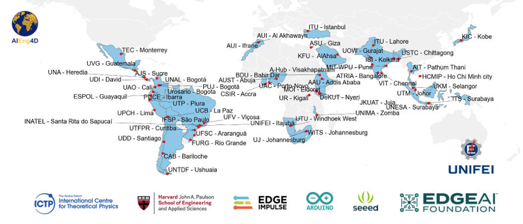

# By Jeremy Ellis Github Profile at [https://github.com/hpssjellis](https://github.com/hpssjellis)

Webpage Link:  [hpssjellis.github.io/AiEng4d/](https://hpssjellis.github.io/AiEng4d/), Github Repository at [hpssjellis/AiEng4d](https://github.com/hpssjellis/AiEng4d)   

# [AIEng4D](https://community.mlsysbook.ai/) (former [TinyML4D](https://tinyml.seas.harvard.edu/))

## [mlsysbook.ai](https://mlsysbook.ai/) by Vijay Janapa Reddi, Harvard

## [Support AIEng4D mlsysbook opencollective](https://opencollective.com/mlsysbook) 

Community of researchers and practitioners focused on both improving access to AI Engineering education and enabling innovative solutions for the unique challenges faced by Developing Countries.

## Robotics Machine Learning Courses & Curriculum By Mr. J. Ellis

### [2026 WebMCU-AI Github Organization: On-Device Machine Learning & WebSerial Assisted Training](https://github.com/webmcu-ai)

### [2026 Maker100 Curriculum](https://github.com/hpssjellis/maker100-curriculum)
### [2026 Maker100 Leaders Robotics](https://github.com/hpssjellis/maker100-leaders-robotics)
### [2026 maker 100 Leaders Robotics Hardware Price List From Source](https://hpssjellis.github.io/maker100-leaders-robotics/price-list-2026.html)
### [2026 Maker100 Youtube Playlist](https://www.youtube.com/watch?v=EvNXQ0sk5Ec&list=PL57Dnr1H_egtkBZJku20Bo2zaR8KUJGpa&index=1&pp=gAQBiAQB)
### [2025 Maker100 XIAO ML Kit](https://github.com/hpssjellis/maker100-xiaoML-kit)
### [2024 maker100 Eco](https://github.com/hpssjellis/maker100-xiaoML-kit)
### [2022 Maker100 Arduino PortentaH7](https://github.com/hpssjellis/maker100)
### [2019 Deprecated Robotics Course](https://github.com/hpssjellis/particle.io-photon-high-school-robotics)

## WebAI Resources and Examples By Mr. J. Ellis

### [local-gemma4-PWA](https://webmcu-ai.github.io/local-gemma4-pwa/index.html) Run the very powerfull Gemma4:e2B and e4B models offline in your browser as an installed Web App.
### [local ollama PWA Gemma4:12B](https://webmcu-ai.github.io/ollama-gemma4-12b-pwa/index.html) Run the very powerfull Gemma4:12B model offline in your browser as an installed Web App with [ollama.com](https://ollama.com/) installed first.
### [Chrome Built-in AI](https://hpssjellis.github.io/teach-chrome-built-in-ai-with-examples/) Used to be behind flags now may just run after the model download. Needs 20 GB space and a 2GB download/
### [Deepseek-R1](https://hpssjellis.github.io/my-examples-of-transformersJS/public/deepseek-r1-webgpu/deepseek-r1-webgpu-00.html). Yes one of the first deepseek that ran in the browser
### [Janus Pro](https://hpssjellis.github.io/my-examples-of-transformersJS/public/janus-pro/janus-pro-to-image-00.html). Image generation in the browser
### [2017 TensorflowJS WebAI](https://hpssjellis.github.io/beginner-tensorflowjs-examples-in-javascript/)

## Workshops & Lectures By Mr. J. Ellis

### [AI for Good Global Summit — Geneva, Switzerland](https://aiforgood.itu.int/speaker/jeremy-ellis/), [Leaders Robotics](https://aiforgood.itu.int/event/the-maker100-leaders-robotics-framework/), video when ready, webpage draft [here](https://hpssjellis.github.io/j-ellis-geneva-2026-ai-for-good-conference-presentation/index.html)
### [AIEng4D Global Show & Tell Sessions](https://discuss.tinyml.seas.harvard.edu/t/tinyml4d-show-and-tell-main-index/1216) — Zero-Cloud & Client-Side EdgeAI Focus
### [TedX Ellis Mission feb13 2026 Why it's important to still do what the machine can do.](https://youtu.be/yM-FTUca23c)

## Papers By Mr. J. Ellis

### [TinyML4D: Scaling Embedded Machine LearningEducation in the Developing World](https://ojs.aaai.org/index.php/AAAI-SS/article/view/31265/33425)
### [On-Device Vision Training, Deployment, and Inference on a Thumb-Sized Microcontroller](https://arxiv.org/abs/2604.23012)
### [WebSerial Vision Training for Microcontrollers: A Browser-Based Companion to On-Device CNN Training](https://arxiv.org/abs/2604.22834)

## About Me Jeremy Ellis

This site is a personal hub for my work with the AIEng4D academic network — the courses, books, workshops, and tutorials gathered here. A little about me:

Jeremy Ellis is a computing educator based in British Columbia, Canada, working on Edge AI, TinyML, and robotics education. He holds a Bachelor of Science in Chemistry, a Bachelor of Education in Secondary Education, and a diploma in counseling, bringing decades of experience teaching computer coding, robotics, the Internet of Things, and machine learning to high school students.

His open educational frameworks, tools, and open-source repositories, hosted publicly on GitHub, are designed to eliminate financial and data privacy barriers for students. He is actively involved in academic networks and initiatives that bring client-side WebAI, EdgeAI, and TinyML development education to students globally through zero-cloud, browser-based configurations.

**[Connect on LinkedIn jeremy-ellis-4237a9bb ↗](https://www.linkedin.com/in/jeremy-ellis-4237a9bb/)**

These materials are part of the [TiyML4D](https://tinyml.seas.harvard.edu/) and now [AIEng4D](https://community.mlsysbook.ai/) initiative, making Embedded & Edge Machine Learning education available to everyone, with an emphasis on enabling innovative solutions for the unique challenges faced by Developing Countries.
