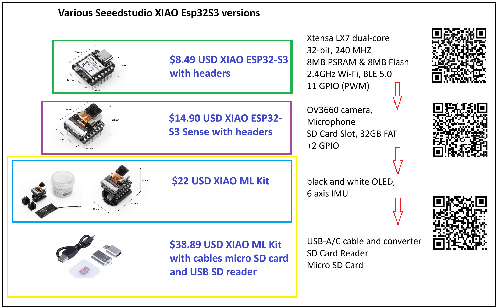

<!--  <link rel="stylesheet" href="./style.css?v=1784931272">   -->

# By Jeremy Ellis Github Profile at [https://github.com/hpssjellis](https://github.com/hpssjellis)

A personal hub for my [robotics courses](#courses), [webAI examples](#WebAI), [workshops](#workshops), [papers](#papers) and the [about me](#about) — part of my work with the AIEng4D network, advancing Edge AI & TinyML education across the Global South.

Webpage Link:  [hpssjellis.github.io/AiEng4d/](https://hpssjellis.github.io/AiEng4d/), Github Repository at [hpssjellis/AiEng4d](https://github.com/hpssjellis/AiEng4d)   

# Link to: [AIEng4D](https://community.mlsysbook.ai/) (former link to: [TinyML4D](https://tinyml.seas.harvard.edu/))

## [mlsysbook.ai](https://mlsysbook.ai/) by Vijay Janapa Reddi, Harvard

## [Support AIEng4D mlsysbook opencollective](https://opencollective.com/mlsysbook) 

Community of researchers and practitioners focused on both improving access to AI Engineering education and enabling innovative solutions for the unique challenges faced by Developing Countries.

## Robotics Machine Learning Courses & Curriculum By Mr. J. Ellis

1. ### [2026 WebMCU-AI Github Organization: On-Device Machine Learning & WebSerial Assisted Training](https://github.com/webmcu-ai) My latest Github Organization
1. ### [2026 Maker100 Curriculum](https://github.com/hpssjellis/maker100-curriculum)
1. ### [2026 Maker100 Leaders Robotics](https://github.com/hpssjellis/maker100-leaders-robotics) My latest robotics course
1. ### [2026 maker 100 Leaders Robotics Hardware Price List From Source](https://hpssjellis.github.io/maker100-leaders-robotics/price-list-2026.html) Price List
1. ### [2026 Maker100 Youtube Playlist](https://www.youtube.com/watch?v=EvNXQ0sk5Ec&list=PL57Dnr1H_egtkBZJku20Bo2zaR8KUJGpa&index=1&pp=gAQBiAQB) All Youtube videos for the XIAO ML Kit
1. ### [2025 Maker100 XIAO ML Kit](https://github.com/hpssjellis/maker100-xiaoML-kit)
1. ### [2024 Maker100 Eco](https://github.com/hpssjellis/maker100-xiaoML-kit)
1. ### [2022 Maker100 Arduino PortentaH7](https://github.com/hpssjellis/maker100)
1. ### [2019 Deprecated Robotics Course](https://github.com/hpssjellis/particle.io-photon-high-school-robotics)

  

## WebAI Resources and Examples By Mr. J. Ellis

1. ### [local-gemma4-PWA](https://webmcu-ai.github.io/local-gemma4-pwa/index.html) Run the very powerfull Gemma4:e2B and e4B models offline in your browser as an installed Web App.
1. ### [local ollama PWA Gemma4:12B](https://webmcu-ai.github.io/ollama-gemma4-12b-pwa/index.html) Run the very powerfull Gemma4:12B model offline in your browser as an installed Web App with [ollama.com](https://ollama.com/) installed first.
1. ### [Chrome Built-in AI](https://hpssjellis.github.io/teach-chrome-built-in-ai-with-examples/) Used to be behind flags now may just run after the model download. Needs 20 GB space and a 2GB download/
1. ### [Deepseek-R1](https://hpssjellis.github.io/my-examples-of-transformersJS/public/deepseek-r1-webgpu/deepseek-r1-webgpu-00.html). Yes one of the first deepseek that ran in the browser
1. ### [Janus Pro](https://hpssjellis.github.io/my-examples-of-transformersJS/public/janus-pro/janus-pro-to-image-00.html). Image generation in the browser
1. ### [2017 TensorflowJS WebAI](https://hpssjellis.github.io/beginner-tensorflowjs-examples-in-javascript/) A massive set of examples for webAI basics.

  

## AiEng4D Online  Student Show And Tell

1. ### [AIEng4D Global Show & Tell Sessions](https://discuss.tinyml.seas.harvard.edu/t/tinyml4d-show-and-tell-main-index/1216) — Student short presentations. [New Link](https://community.mlsysbook.ai/community/show)
2. ### [Student Sign Up Form](https://forms.gle/ic52HZMqVv4pBrkP7)
3. ### [Main Google Meet for the last Thursday 6am PST time zone Student AIEng4D Show and Tell](https://meet.google.com/rns-yyrx-ggw)

  

## Workshops Attended & Lectures By Mr. J. Ellis

1. ### [AI for Good Global Summit — Geneva, Switzerland](https://aiforgood.itu.int/speaker/jeremy-ellis/), [Leaders Robotics](https://aiforgood.itu.int/event/the-maker100-leaders-robotics-framework/), video when ready, webpage draft [here](https://hpssjellis.github.io/j-ellis-geneva-2026-ai-for-good-conference-presentation/index.html)
1. ### [TedX Ellis Mission feb13 2026 Why it's important to still do what the machine can do.](https://youtu.be/yM-FTUca23c)
1. ### [Workshop on TinyML for Sustainable Development – IBM/ICTP – Brazil (2024)](https://tinyml.seas.harvard.edu/SustainableDev-24/)
1. ### [SciTinyML: Scientific Use of Machine Learning on Low-Power Devices – Virtual – (2024)](https://tinyml.seas.harvard.edu/SciTinyML-24/)
1. ### [SciTinyML: Scientific Use of Machine Learning on Low-Power Devices - Virtual - (2023)](https://tinyml.seas.harvard.edu/SciTinyML-23/)
1. ### [Workshop on Widening Access to TinyML Network by Establishing Best Practices in Education Trieste Italy (July 2023)](https://indico.ictp.it/event/10185/other-view?view=ictptimetable)

  

## Papers collaborated on or by Mr. J. Ellis

1. ### [TinyML4D: Scaling Embedded Machine Learning Education in the Developing World, B. Plancher](https://ojs.aaai.org/index.php/AAAI-SS/article/view/31265/33425)
1. ### [On-Device Vision Training, Deployment, and Inference on a Thumb-Sized Microcontroller, J. Ellis (ArXiv 2604.23012)](https://arxiv.org/abs/2604.23012)
1. ### [WebSerial Vision Training for Microcontrollers: A Browser-Based Companion to On-Device CNN Training, J. Ellis (ArXiv 2604.22834)](https://arxiv.org/abs/2604.22834)

  

## About Me, Jeremy Ellis

This site is a personal hub for my work with the AIEng4D academic network — the courses, books, workshops, and tutorials gathered here. A little about me:

Jeremy Ellis is a computing educator based in British Columbia, Canada, working on Edge AI, TinyML, and robotics education. He holds a Bachelor of Science in Chemistry, a Bachelor of Education in Secondary Education, and a diploma in counseling, bringing decades of experience teaching computer coding, robotics, the Internet of Things, and machine learning to high school students.

His open educational frameworks, tools, and open-source repositories, hosted publicly on GitHub, are designed to eliminate financial and data privacy barriers for students. He is actively involved in academic networks and initiatives that bring client-side WebAI, EdgeAI, and TinyML development education to students globally through zero-cloud, browser-based configurations.

**[Connect on LinkedIn jeremy-ellis-4237a9bb ↗](https://www.linkedin.com/in/jeremy-ellis-4237a9bb/)**

  

These materials are part of the [TiyML4D](https://tinyml.seas.harvard.edu/) and now [AIEng4D](https://community.mlsysbook.ai/) initiative, making Embedded & Edge Machine Learning education available to everyone, with an emphasis on enabling innovative solutions for the unique challenges faced by Developing Countries.
