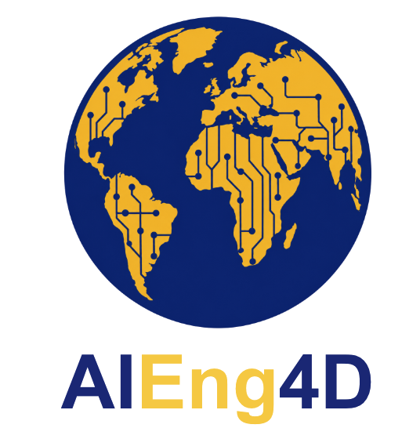

# AiEng4d
AiEng4D formerly TinyML4D      

Webpage Link:  https://hpssjellis.github.io/AiEng4d/

# AIEng4D (former TinyML4D)

[Community of researchers and practitioners focused on both improving access to AI Engineering education and enabling innovative solutions for the unique challenges faced by Developing Countries.](https://tinyml.seas.harvard.edu/4D/AcademicNetwork)

## Courses & Curriculum
### [Maker100 Leaders Robotics Curriculum](https://github.com/hpssjellis/maker100-robotics)
### [WebMCU-AI Browser-Based Machine Learning & WebSerial Framework](https://github.com/webmcu-ai)

## Workshops & Lectures

### Highlights
- #### [AI for Good Global Summit — Geneva, Switzerland](https://github.com/hpssjellis)
- #### AIEng4D Global Show & Tell Sessions — Zero-Cloud & Client-Side EdgeAI Focus

## Tutorials & Frameworks
### [Seeed Studio XIAO ESP32S3 & MicroPython Guides](https://github.com/hpssjellis/my-ESP32-Micropython)
### [Client-Side WebAI & WebSerial Tutorials](https://github.com/webmcu-ai)
### [Arduino & Robotics Classroom Frameworks](https://github.com/hpssjellis)

## About Me

This site is a personal hub for my work with the AIEng4D academic network — the courses, books, workshops, and tutorials gathered here. A little about me:

Jeremy Ellis is a computing educator based in British Columbia, Canada, working on Edge AI, TinyML, and robotics education. He holds a Bachelor of Science in Chemistry, a Bachelor of Education in Secondary Education, and a diploma in counseling, bringing decades of experience teaching computer coding, robotics, the Internet of Things, and machine learning to high school students.

His open educational frameworks, tools, and open-source repositories, hosted publicly on GitHub, are designed to eliminate financial and data privacy barriers for students. He is actively involved in academic networks and initiatives that bring client-side WebAI, EdgeAI, and TinyML development education to students globally through zero-cloud, browser-based configurations.

**[Connect on LinkedIn jeremy-ellis-4237a9bb ↗](https://www.linkedin.com/in/jeremy-ellis-4237a9bb/)**

These materials are part of the [AIEng4D](https://tinyml.seas.harvard.edu/) initiative, making Embedded & Edge Machine Learning education available to everyone, with an emphasis on enabling innovative solutions for the unique challenges faced by Developing Countries.
